<h1 align="center">Interior-consultant</h1>

   Solution for a challenge from  <a href="http://devchallenges.io" target="_blank">Devchallenges.io</a>.

  <h3>
    <a href="https://dc-interior-consultant.netlify.app/">
      Demo
    </a>
     | 
    <a href="https://github.com/therahulchaurasia/interior-consultant-dc">
      Solution
    </a>
     | 
    <a href="https://devchallenges.io/challenges/Jymh2b2FyebRTUljkNcb">
      Challenge
    </a>
  </h3>

## Table of contents

- [Overview](#overview)
  - [The challenge](#the-challenge)
  - [Screenshot](#screenshot)
  - [Links](#links)
- [My process](#my-process)
  - [Built with](#built-with)
  - [What I learned](#what-i-learned)
  - [Useful resources](#useful-resources)
- [Author](#author)

## Overview

### The challenge

Users should be able to:

- View the optimal layout for the app depending on their device's screen size
- See hover states for all interactive elements on the page
- User can see a collapsed navigation on mobile
- When I select the hamburger menu, I can see a navigation on mobile

### Screenshot

<table>
 <tr>
    <td><b style="font-size:20px">Design</b></td>
    <td><b style="font-size:20px">Desktop</b></td>    
 </tr>
 <tr>
    <td>
		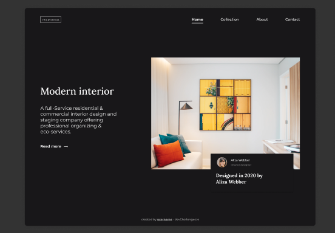
		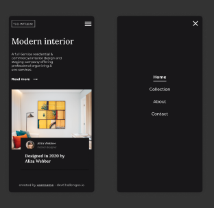
    </td>
      <td>
    	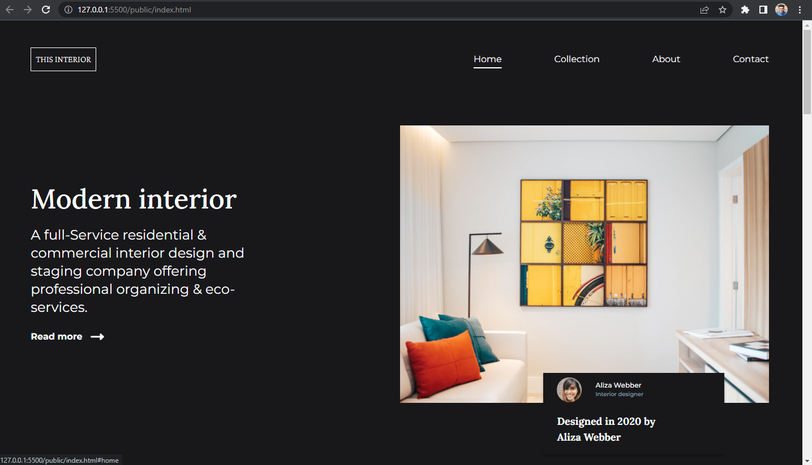
      	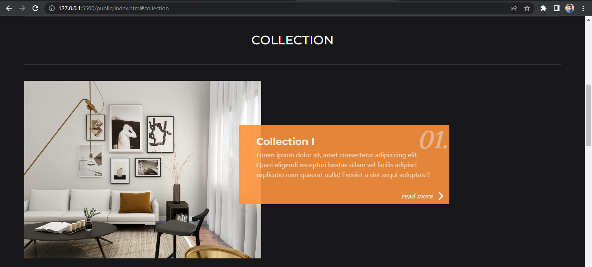
    	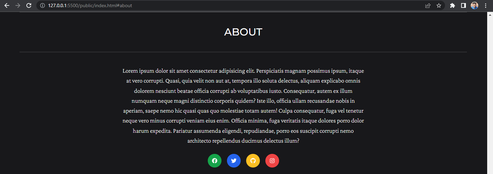
    	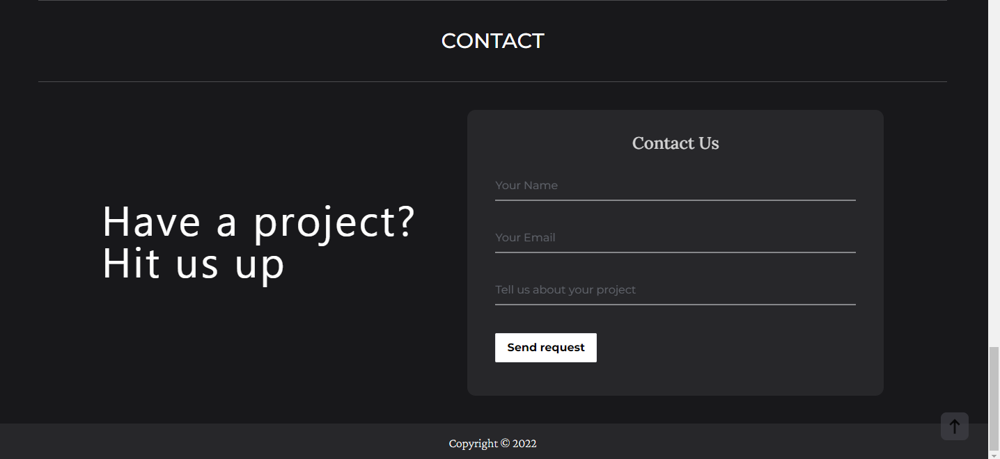
      </td>    
 </tr>
  <tr>
    <td><b style="font-size:20px">Tablet</b></td>
    <td><b style="font-size:20px">Mobile</b></td>
 </tr>
  <tr>
     <td>
    	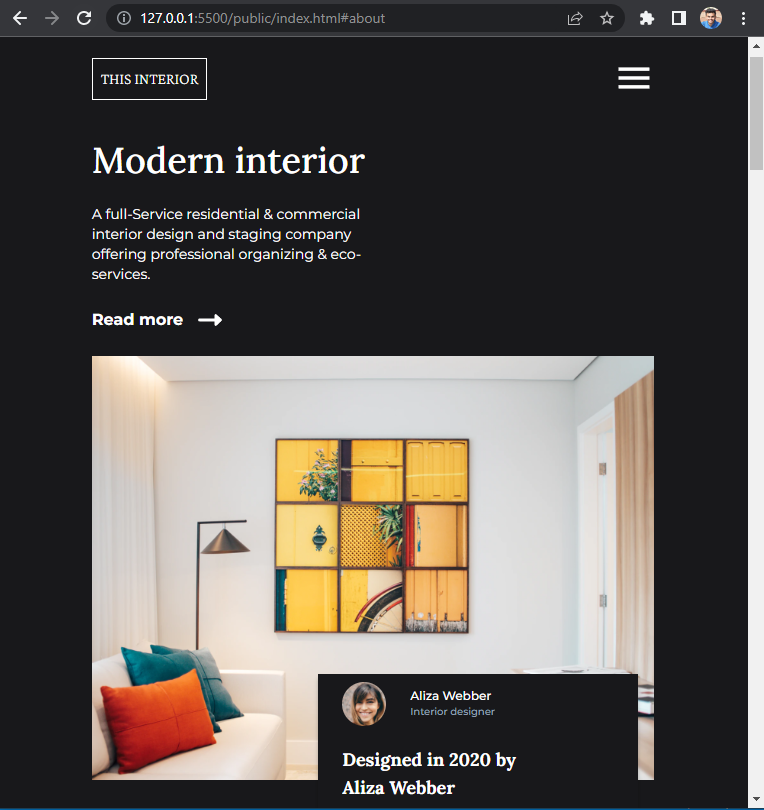
      	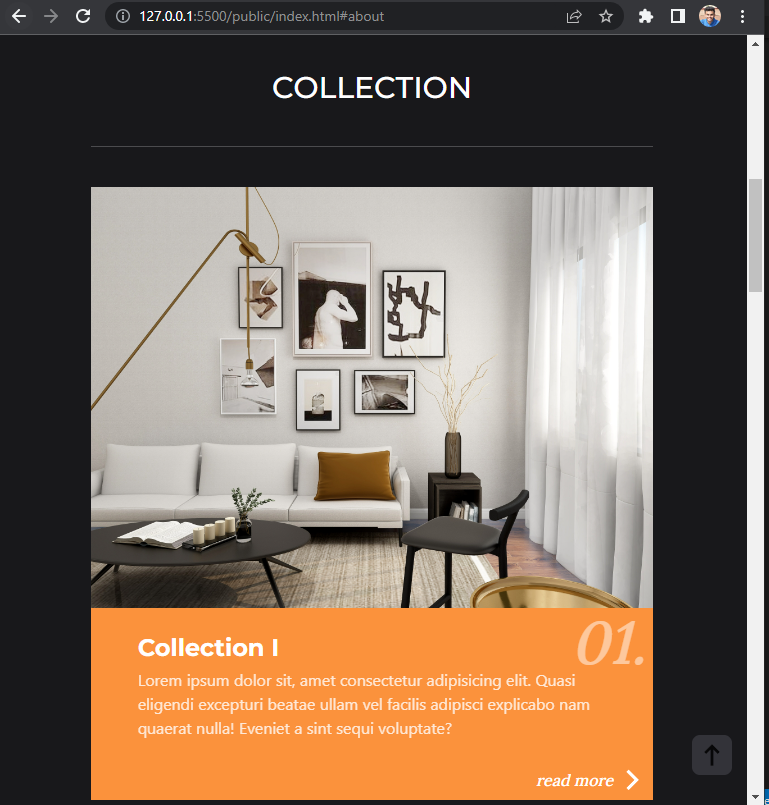
    	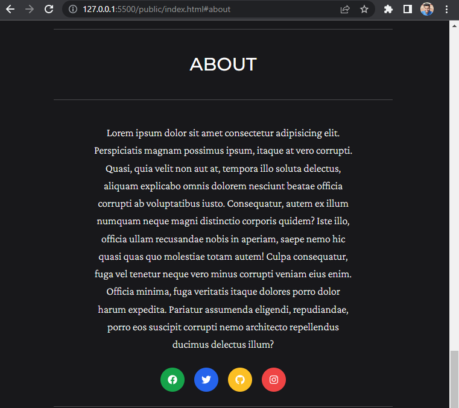
    	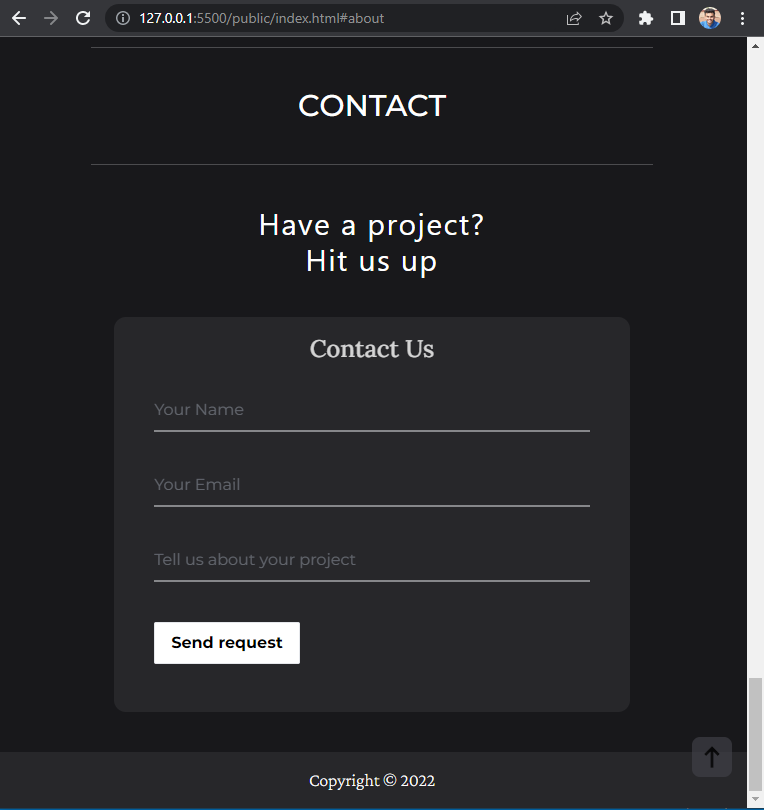
      </td>   
     <td>
    	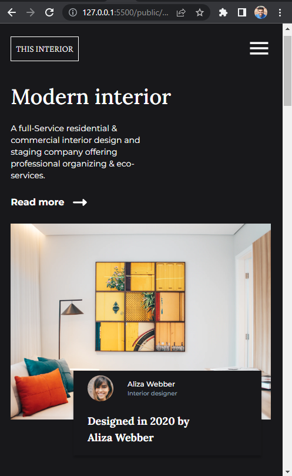
      	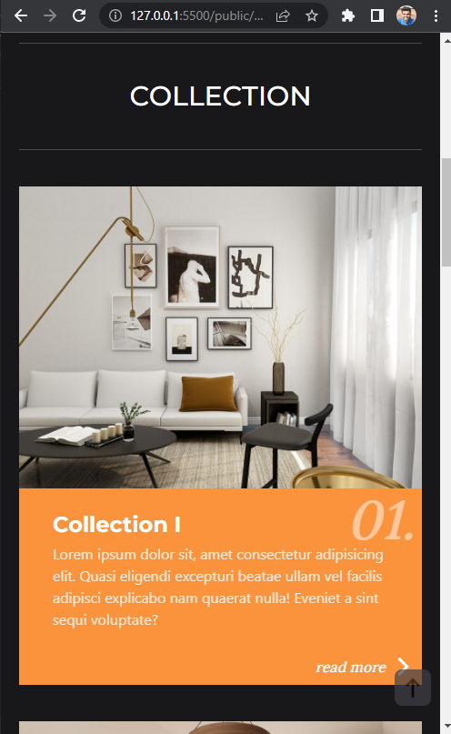
    	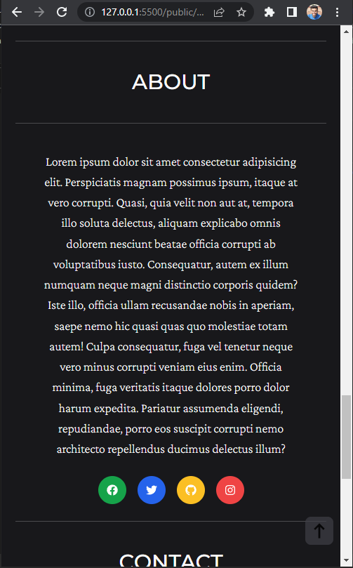
    	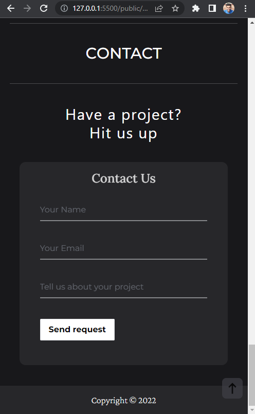
    	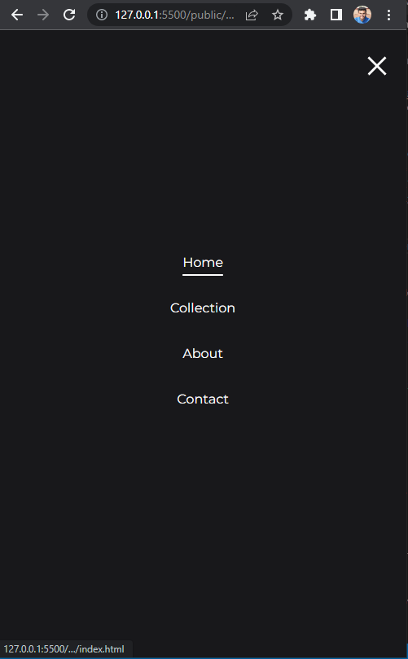
      </td>   
  </tr>

</table>

## My process

1.  Firstly I created the mobile UI using Tailwindcss
2.  Then the next step was to add the toggle.
3.  Worked on the tablet UI and desktop UI.
4.  Added the required functionality to the pages

### Built with

- [Tailwind](https://tailwindcss.com/)

### What I learned

### The project was supposed to be a single static screen as per the design but I decided to add the remaining parts into the page and it turns out that the page looks great. I was able to experiment with colors and different styles and screen ratios. I was able to experiment extensively with Tailwind in this project.

### Useful resources

- [MDN web docs](https://developer.mozilla.org/en-US/docs/Web/JavaScript) - Used the docs to check various properties, their working and features.
- [Tailwindcss](https://tailwindcss.com/) - Used the docs to check various properties, their working and features.
- Visited dribbble, behance and pinterest for design inspiration.

## Author

- GitHub [@therahulchaurasia](https://github.com/therahulchaurasia)
